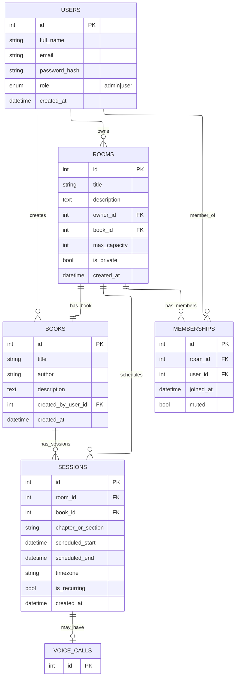

# Bookclub App

A voice-first social platform for structured book discussions, combining the scheduled nature of traditional book clubs with the accessibility of modern voice chat applications.

## Overview
Bookclub Rooms enables users to create dedicated discussion spaces for specific books, complete with chapter-by-chapter reading schedules and timed voice sessions. The platform ensures quality content through an administrative approval process while maintaining the spontaneous energy of live voice conversations.

## Key Features

**Structured Reading Experience**: Each room centers on a specific book with predefined chapters and scheduled discussion sessions, creating accountability and shared progress among members.

**Quality Assurance**: Platform administrators review and approve all rooms before publication, ensuring content standards and preventing spam or inappropriate material.

**Voice-First Communication**: Real-time voice discussions with distinct roles for speakers and listeners, emoji reactions, and moderation capabilities.

**Membership**: Users can discover and join approved rooms subject to capacity limits, with support for both public and invite-only communities.

**Notifications**: Automated reminders ensure members stay informed about upcoming sessions through multiple channels including in-app, email, and push notifications.

## Technical Architecture

The platform utilizes a modern full-stack architecture optimized for real-time communication and scalable user management.

**Frontend**: Built with Next.js, styled with Tailwind CSS for responsive design across desktop and mobile devices.

**Backend**: Mainly will go with Nest.js and MongoDB for database.

**Voice Infrastructure**: ...

**Hosting**: Deployed on Vercel for optimal performance and automatic scaling, with Supabase managing database and storage services.

## ER Diagram



## API Documentation

### Authentication Endpoints

The application provides a complete authentication system with JWT tokens and refresh token support.

#### POST /auth/register
Register a new user account.
```json
{
  "firstName": "John",
  "lastName": "Doe", 
  "email": "john@example.com",
  "password": "SecurePass123!"
}
```

#### POST /auth/login
Authenticate user and receive access token. Refresh token is set as httpOnly cookie.
```json
{
  "email": "john@example.com",
  "password": "SecurePass123!"
}
```

#### POST /auth/refresh-token
Refresh access token using httpOnly cookie. No body required.

#### GET /auth/me
Get current user information (requires authentication).
**Headers:** `Authorization: Bearer <access_token>`

#### PUT /auth/me
Update user profile (requires authentication).
**Headers:** `Authorization: Bearer <access_token>`
```json
{
  "firstName": "John",
  "lastName": "Doe",
  "username": "johndoe",
  "bio": "Book lover and software developer",
  "avatar": "https://example.com/avatar.jpg",
  "dateOfBirth": "1990-01-01",
  "gender": "male"
}
```

### Security Features

- **JWT Authentication**: Secure token-based authentication
- **Refresh Tokens**: Automatic token refresh with httpOnly cookies
- **Password Hashing**: Bcrypt encryption for user passwords
- **Input Validation**: Comprehensive validation for all endpoints
- **Role-Based Authorization**: User roles (user, admin) for access control

### Getting Started

1. Clone the repository
2. Install dependencies: `npm install`
3. Copy `.env.example` to `.env` and configure your environment variables
4. Start the development server: `npm run start:dev`
5. Access API documentation at `http://localhost:3080/api`

The server will start on port 3080 by default. Swagger documentation is available at `/api` endpoint.